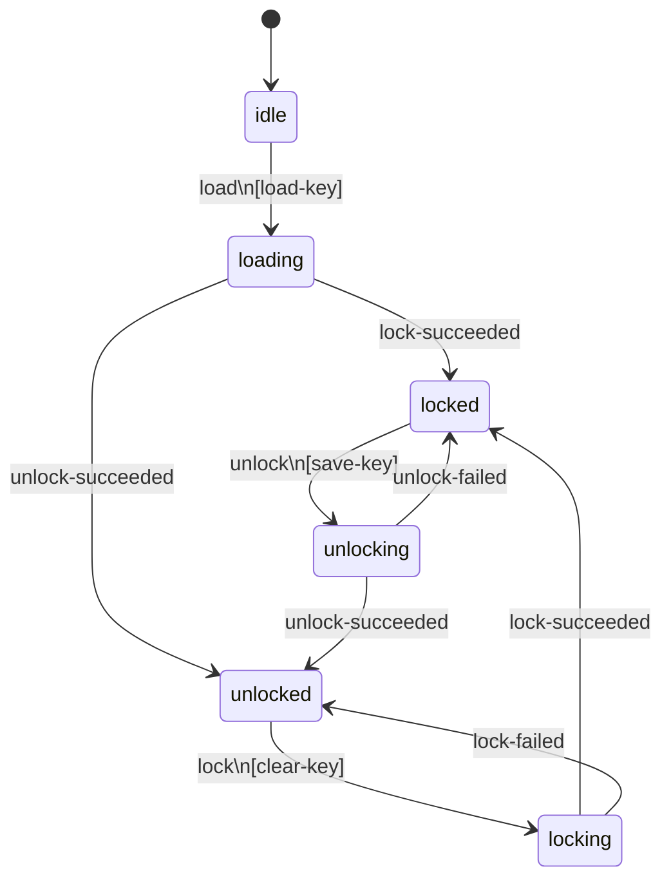

```mermaid
stateDiagram-v2
    [*] --> idle

    idle --> loading : load\n[load-key]

    loading --> locked : lock-succeeded
    loading --> unlocked : unlock-succeeded

    locked --> unlocking : unlock\n[save-key]

    unlocking --> unlocked : unlock-succeeded
    unlocking --> locked : unlock-failed

    unlocked --> locking : lock\n[clear-key]

    locking --> locked : lock-succeeded
    locking --> unlocked : lock-failed
```
